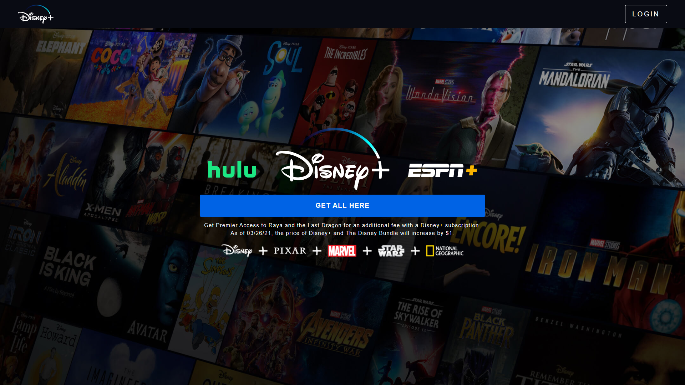
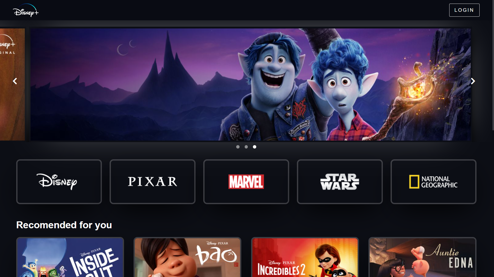

# ✨ Disney+ Clone 
I made this project for an event organised at [code damn](https://codedamn.com/) on the ocasion of hacktober fest

# 📸 Screenshots

## ⚙️ Built with
- Semantic HTML5 markup
- CSS Grid
- Javascript

Building the carousel was the most fun part it was challenging but fun :)

Disney+ Clone ~ [Live Demo](https://1hanif1.github.io/Disneyplus-Clone/)

## 👤 My Socials

- Twitter - [@HMohammedB\_](https://twitter.com/HMohammedB_)
- Github: [@1Hanif1](https://github.com/1Hanif1)

Give a ⭐️ if you like my project :)
